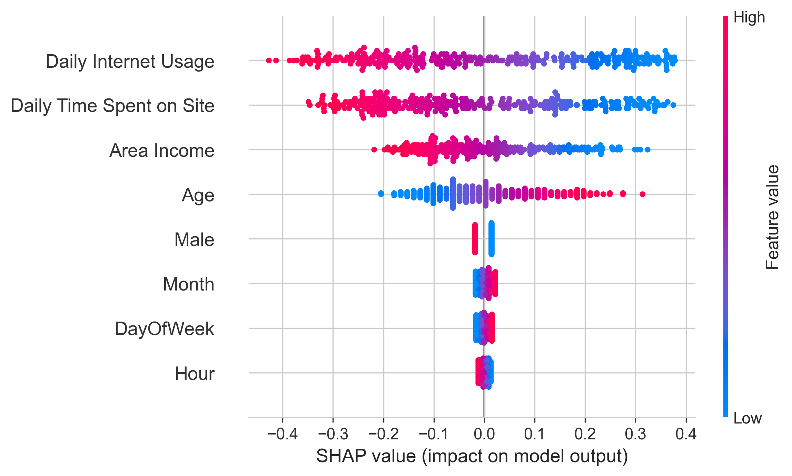

# Projeto de Classificação: Previsão de Cliques em Anúncios Online

## 📄 Sumário

Este projeto de portfólio demonstra um fluxo completo de Machine Learning, desde a preparação dos dados até a avaliação comparativa de modelos, para prever se um usuário de internet clicará em um anúncio. O modelo campeão, uma **Regressão Logística** otimizada, alcançou um **AUC (Area Under the Curve) de 0.998**, provando ser uma solução robusta, precisa e interpretável para resolver o problema de negócio.

---

## 🎯 Contexto e Objetivo de Negócio

O objetivo deste projeto é desenvolver um modelo de classificação binária que responda à pergunta: 

**"Com base no perfil e comportamento de um usuário, qual a probabilidade de ele clicar em um anúncio online?"**

Uma solução eficaz para este problema permite que equipes de marketing digital otimizem o retorno sobre o investimento (ROI) em campanhas, direcionando anúncios de forma mais inteligente e personalizando o conteúdo para perfis com maior propensão à conversão.

---

## 🛠️ Metodologia Aplicada

O projeto foi desenvolvido seguindo um fluxo de trabalho estruturado de Machine Learning, garantindo que cada decisão fosse informada por dados e melhores práticas.

### 1. Preparação e Engenharia de Features

A base do nosso modelo foi construída sobre dados de alta qualidade. O processo, detalhado no notebook `01_data_preparation.ipynb`, consistiu em:
* **Limpeza de Dados:** Remoção de colunas com alta cardinalidade (`Ad Topic Line`, `City`, `Country`) que poderiam introduzir ruído e complexidade desnecessária ao modelo.
* **Engenharia de Features:** Para capturar padrões temporais, a coluna `Timestamp` foi transformada em features mais úteis para o modelo, como `Hour` (Hora do Dia), `DayOfWeek` (Dia da Semana) e `Month` (Mês).

### 2. Análise Exploratória de Dados (EDA)

Com os dados limpos, a análise no notebook `02_logistic_regression_analysis.ipynb` buscou entender as relações entre as variáveis.

Os principais insights visuais dos boxplots foram:
* **Comportamento de Navegação:** Usuários que clicam em anúncios (Clicked on Ad = 1) passam, em média, menos tempo no site (aproximadamente 40-50 minutos) em comparação com os que não clicam (70-80 minutos). A mesma tendência se aplica ao uso diário de internet.
* **Perfil Demográfico:** O grupo que clica nos anúncios tende a ser mais velho (mediana de idade em torno de 40 anos) do que o grupo que não clica (mediana próxima aos 30 anos).

Essas descobertas iniciais, validadas visualmente, foram cruciais para confirmar a relevância das features selecionadas.

### 3. Construção e Otimização de Modelos

A modelagem foi uma busca pela melhor combinação de performance e simplicidade:
* **Modelo Baseline:** A **Regressão Logística** foi escolhida como ponto de partida por sua eficiência e alta interpretabilidade.
* **Otimização:** Para maximizar a performance, foi utilizado um `Pipeline` com `StandardScaler` para padronizar os dados e o `GridSearchCV` para encontrar o hiperparâmetro de regularização `C` ideal, garantindo que o modelo generalize bem para novos dados.
* **Benchmarking:** Para validar nossa escolha, o modelo otimizado foi comparado com algoritmos mais complexos e de alta performance: `Random Forest` e `XGBoost`.

### 4. Interpretabilidade com SHAP

Não bastava ter um modelo preciso; era essencial entender *por que* ele toma suas decisões. Para isso, foi utilizada a biblioteca **SHAP**.

* `Daily Internet Usage` e `Daily Time Spent on Site` são os fatores de maior impacto. Valores altos (pontos vermelhos) têm um forte impacto negativo (empurram a previsão para a esquerda, ou seja, para "não clicar").
* `Age` é o terceiro fator mais importante. Valores altos (vermelho) têm um impacto positivo (empurram a previsão para a direita, ou seja, para "clicar").

Isso nos deu grande confiança não apenas nos resultados, mas também na lógica do modelo.

---

## 📈 Resultados e Análise Comparativa

A etapa de modelagem culminou em uma análise comparativa para determinar o algoritmo com a melhor performance preditiva para este problema.

### Tabela de Benchmarking dos Modelos

A tabela abaixo resume a performance dos três modelos testados no conjunto de dados de teste. A avaliação foi baseada nas métricas de **AUC (Area Under the Curve)** — que mede a capacidade do modelo de distinguir entre as classes — e **Acurácia**.

| Modelo | AUC | Accuracy |
| :--- | :---: | :---: |
| **🥇 Logistic Regression** | **0.9980** | **0.9733** |
|🥈 Random Forest | 0.9947 | 0.9567 |
|🥉 XGBoost | 0.9882 | 0.9467 |

O resultado mais significativo do benchmark é que o modelo de **Regressão Logística otimizado superou os modelos de ensemble mais complexos**, oferecendo a melhor performance geral. Isso demonstra que, para este problema, a simplicidade e a interpretabilidade não vieram ao custo de performance.

### Análise de Performance do Modelo Campeão

Para uma análise mais profunda do desempenho da Regressão Logística, examinamos os resultados detalhados.

| Métrica | Classe 0 (Não Clicou) | Classe 1 (Clicou) | Média Ponderada |
| :--- | :---: | :---: | :---: |
| **Precision** | 0.95 | 1.00 | 0.97 |
| **Recall** | 1.00 | 0.94 | 0.97 |
| **F1-Score** | 0.98 | 0.97 | 0.97 |
| **Accuracy** | - | - | **0.97** |

A análise da tabela e do gráfico nos permite tirar conclusões poderosas:

* **O modelo é extremamente preciso:** A `Precision` para a classe 1 (usuários que clicaram) é de **1.00**. Isso significa que **todas as vezes** que o modelo previu que um usuário clicaria no anúncio, ele estava correto. Isso é confirmado na matriz de confusão pela ausência de "Falsos Positivos".

* **O modelo é robusto e captura a maioria dos cliques:** O `Recall` para a classe 1 é de **0.94**. Isso indica que o modelo conseguiu identificar corretamente **94% de todos os usuários que realmente clicaram** no anúncio, errando em apenas uma pequena fração dos casos.

Essa combinação de alta precisão e alto recall torna o modelo uma ferramenta muito confiável para o negócio.

---
